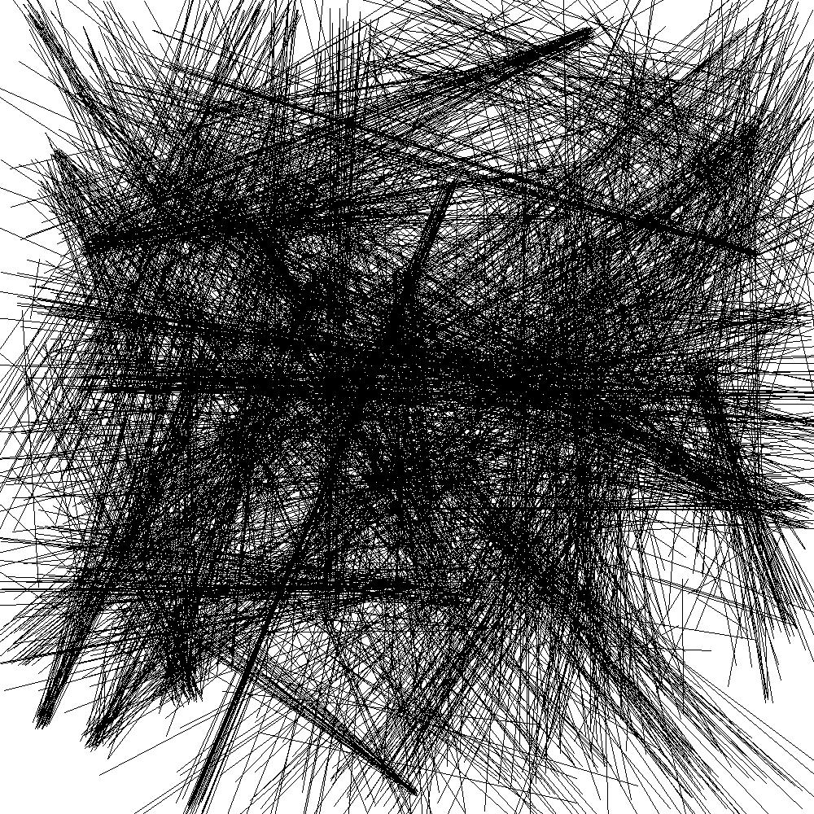
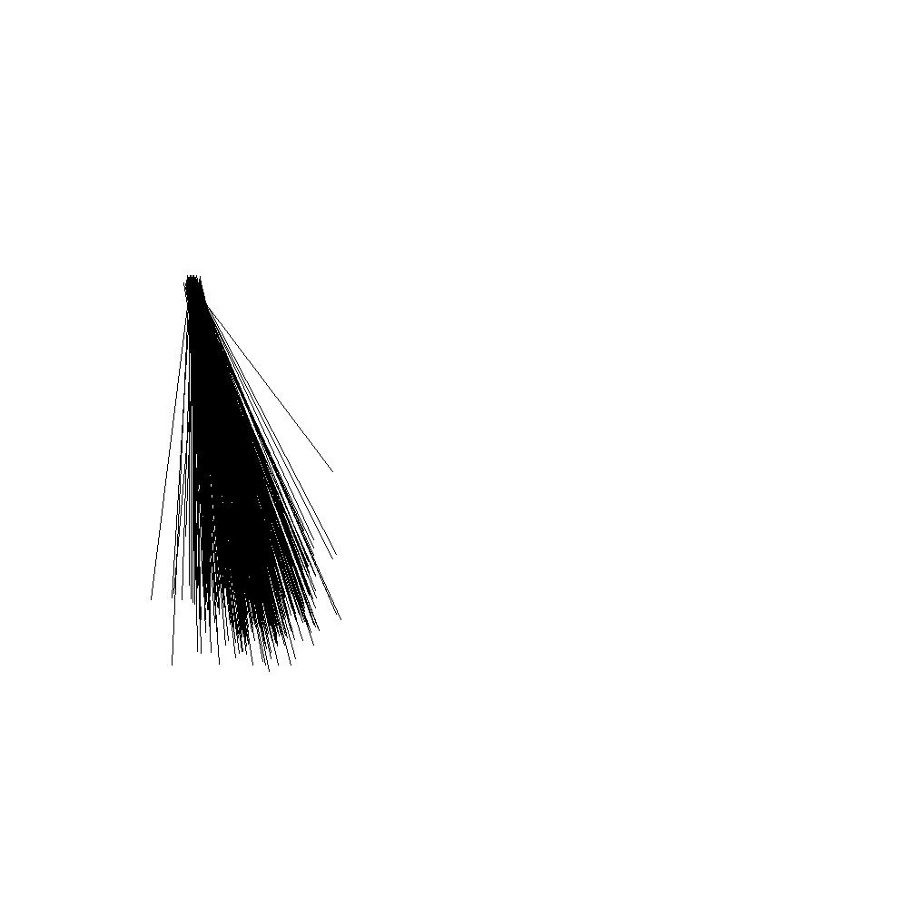
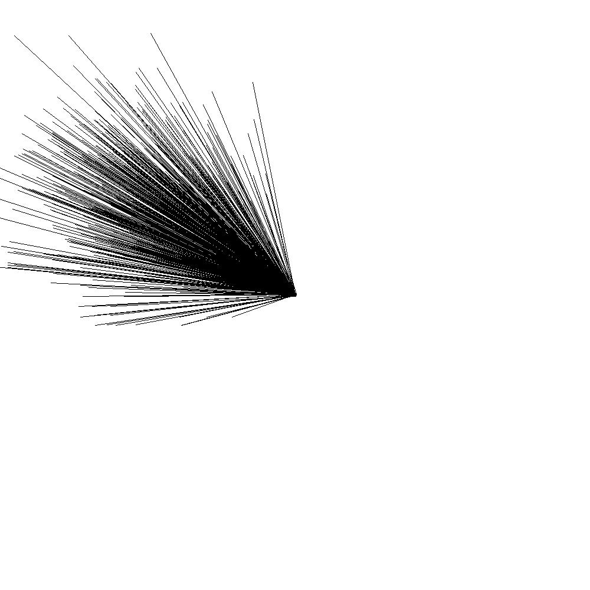
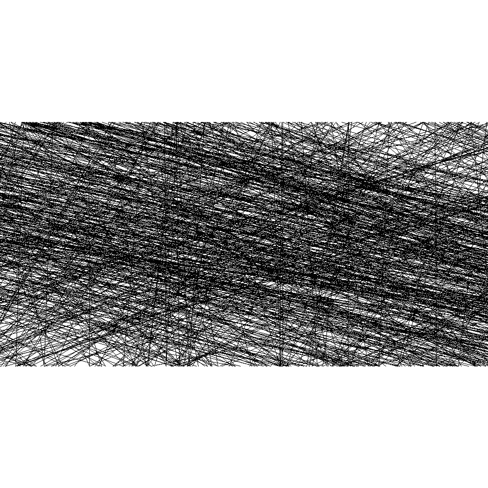
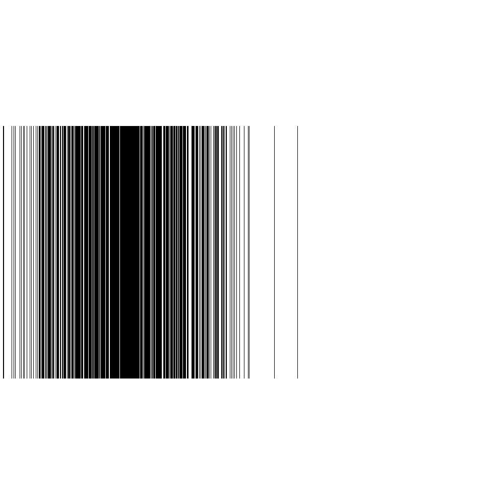
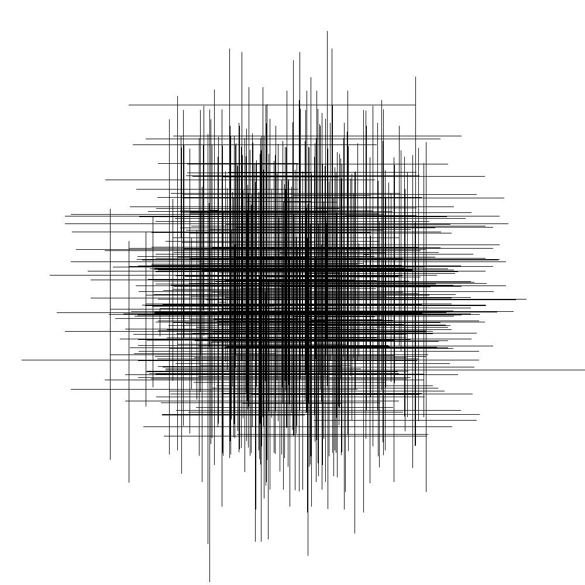

Chaos Studio
=== 

## Requirements

#### Using Python

- Python 3.8

#### Using Docker

- Docker
- Make

## Creating your Chaos

#### Using Docker

1 - Be amazed just running:
``` sh
make start
```

## Running examples

A few drawing examples can be found in the `samples` directory, and its session code into `sessions`.
Create your own draw using:
``` sh
python sessions/<draw>.py
``` 

## Sample images

#####Draw1


#####Draw2


#####Draw3


#####Draw4


#####Draw5


#####Draw6


#####Draw7


