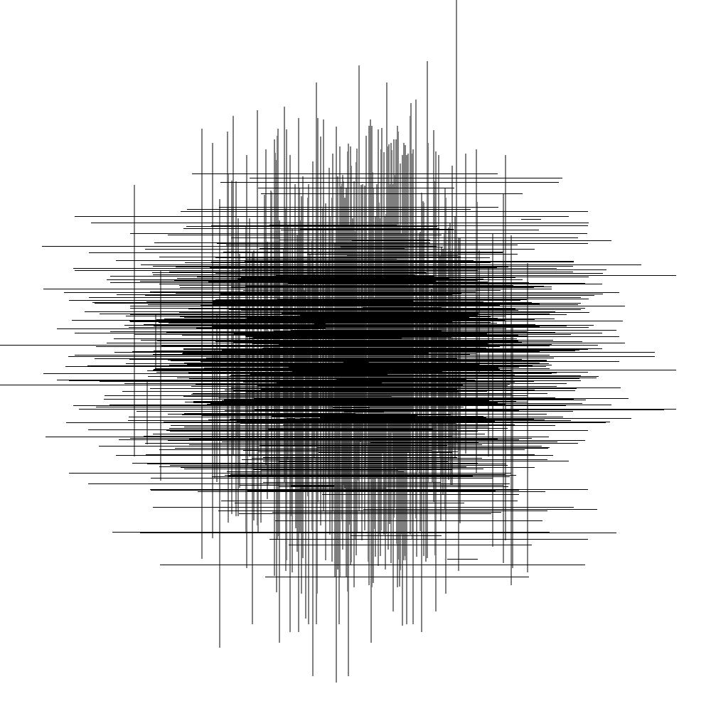

Chaos Studio
=== 

## Requirements

#### Using Python

- Python 3.10

#### Using Docker

- Docker
- Make

## Creating your Chaos

#### Using Docker

Be amazed just running:
``` sh
make start
```

## Running examples

A few drawing examples can be found in the `docs/samples` directory together with its code.
Create your own drawing using:
``` sh
python docs/samples/<draw>.py
``` 

## Sample images

#### Draw1


#### Draw2


#### Draw3


#### Draw4


#### Draw5


##### Draw6


#### Draw7


